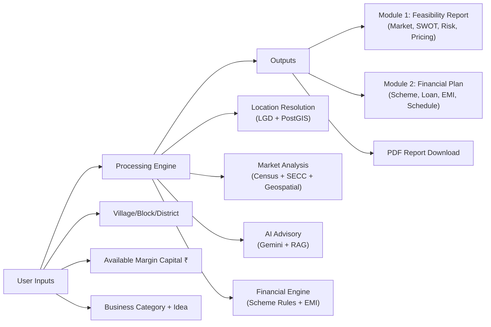
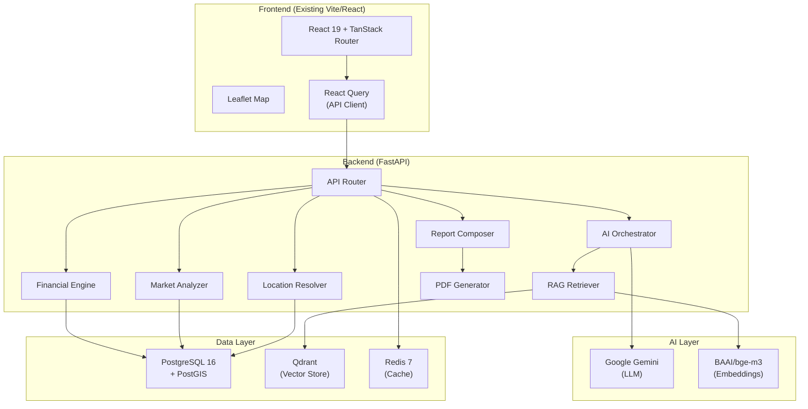

# UdyamAI — Production Architecture & Implementation Plan

## Part A: Repository Audit

---

### 1. Current Architecture

| Layer | Status | What Exists |
|-------|--------|-------------|
| **Frontend** | ✅ Functional (demo mode) | React 19 + TanStack Router/Start + Tailwind v4 + shadcn/ui (Lovable-generated) |
| **Backend** | ❌ **Missing entirely** | No FastAPI, no Python server, no API endpoints |
| **Database Schema** | ✅ Well-designed | PostgreSQL + PostGIS schema with 17+ tables, indexes, triggers, seed data |
| **Data Ingestion** | ⚠️ Partial | Python scripts exist but target Supabase; need adaptation for local Docker Postgres |
| **AI / RAG** | ❌ **Missing entirely** | No Gemini, no LangChain, no Qdrant, no embeddings |
| **Caching** | ❌ **Missing** | No Redis integration |
| **Datasets** | ✅ Rich | LGD, Census PCA, SECC, PMGSY shapefiles, CPI, HCES, lat/lon for 8 Maharashtra districts |

#### Existing Architectural Patterns
- **Monolithic single-page app**: Entire frontend in one 259-line file ([`index.tsx`](file:///c:/PROJECTS/UdyamAI/frontend/src/routes/index.tsx))
- **Client-side-only computation**: [`grambiz-data.ts`](file:///c:/PROJECTS/UdyamAI/frontend/src/lib/grambiz-data.ts) computes all analysis with hardcoded values — no backend calls
- **SSR-ready shell**: TanStack Start with Nitro server entry ([`server.ts`](file:///c:/PROJECTS/UdyamAI/frontend/src/server.ts)) — not leveraged for API
- **Idempotent ingestion**: Python scripts use `ON CONFLICT DO UPDATE` upsert pattern

#### Missing Architectural Components
- Backend API server (FastAPI)
- AI orchestration layer (Gemini + LangChain)
- RAG pipeline (Qdrant + BAAI/bge-m3 embeddings)
- Geospatial query engine (PostGIS radius queries)
- Caching layer (Redis)
- PDF report generation
- Environment configuration (.env)
- Docker Compose orchestration
- Testing framework (zero tests anywhere)
- CI/CD pipeline

---

### 2. Entry Points

| Entry Point | File | Purpose |
|-------------|------|---------|
| Frontend dev server | [`frontend/package.json`](file:///c:/PROJECTS/UdyamAI/frontend/package.json) → `npm run dev` | Vite dev server |
| Frontend SSR entry | [`frontend/src/server.ts`](file:///c:/PROJECTS/UdyamAI/frontend/src/server.ts) | TanStack Start SSR handler |
| Frontend app entry | [`frontend/src/start.ts`](file:///c:/PROJECTS/UdyamAI/frontend/src/start.ts) | Middleware chain |
| DB schema | [`database/schema.sql`](file:///c:/PROJECTS/UdyamAI/database/schema.sql) | Core schema |
| DB module2 schema | [`database/module2_schema.sql`](file:///c:/PROJECTS/UdyamAI/database/module2_schema.sql) | Financial calculator tables |
| Data ingestion | [`database/scripts/load_supabase.py`](file:///c:/PROJECTS/UdyamAI/database/scripts/load_supabase.py) | LGD + location loader |
| Data validation | [`database/scripts/validate_database.py`](file:///c:/PROJECTS/UdyamAI/database/scripts/validate_database.py) | DB integrity checks |

---

### 3. Major Modules

#### Frontend Modules
| Module | File | Description |
|--------|------|-------------|
| Route tree | [`routeTree.gen.ts`](file:///c:/PROJECTS/UdyamAI/frontend/src/routeTree.gen.ts) | Auto-generated — single `/` route |
| Router | [`router.tsx`](file:///c:/PROJECTS/UdyamAI/frontend/src/router.tsx) | TanStack Router + React Query |
| Root layout | [`__root.tsx`](file:///c:/PROJECTS/UdyamAI/frontend/src/routes/__root.tsx) | SEO meta, fonts, error boundaries |
| Main app | [`index.tsx`](file:///c:/PROJECTS/UdyamAI/frontend/src/routes/index.tsx) | **Monolithic 55KB file** — Landing, Form, Loader, Report, Finance, Summary |
| Business logic | [`grambiz-data.ts`](file:///c:/PROJECTS/UdyamAI/frontend/src/lib/grambiz-data.ts) | Types, scheme selection, EMI calc, demo analysis builder |
| UI components | [`components/ui/`](file:///c:/PROJECTS/UdyamAI/frontend/src/components/ui) | 46 shadcn/ui components (full library) |
| Utilities | [`lib/utils.ts`](file:///c:/PROJECTS/UdyamAI/frontend/src/lib/utils.ts) | `cn()` class merge utility |
| Mobile hook | [`hooks/use-mobile.tsx`](file:///c:/PROJECTS/UdyamAI/frontend/src/hooks/use-mobile.tsx) | Responsive breakpoint hook |

#### Database Modules (Python Scripts)
| Script | Purpose |
|--------|---------|
| [`load_supabase.py`](file:///c:/PROJECTS/UdyamAI/database/scripts/load_supabase.py) | Main LGD + location ingestion pipeline |
| [`load_supabase_full.py`](file:///c:/PROJECTS/UdyamAI/database/scripts/load_supabase_full.py) | Extended ingestion with PMGSY shapefiles |
| [`insert_locations.py`](file:///c:/PROJECTS/UdyamAI/database/scripts/insert_locations.py) | Fuzzy-matched village geocoding + Nominatim fallback |
| [`insert_secc.py`](file:///c:/PROJECTS/UdyamAI/database/scripts/insert_secc.py) | SECC economic data loader |
| [`load_shapefiles.py`](file:///c:/PROJECTS/UdyamAI/database/scripts/load_shapefiles.py) | PMGSY road/facility shapefile loader |
| [`validate_database.py`](file:///c:/PROJECTS/UdyamAI/database/scripts/validate_database.py) | Data integrity checks |
| [`inspect_datasets.py`](file:///c:/PROJECTS/UdyamAI/database/scripts/inspect_datasets.py) | Dataset file inventory |

---

### 4. Dependencies Analysis

#### Frontend ([`package.json`](file:///c:/PROJECTS/UdyamAI/frontend/package.json))

| Category | Dependencies | Status |
|----------|-------------|--------|
| **Core** | React 19, react-dom 19, TanStack Router 1.170, TanStack Start 1.168, TanStack React Query 5.101 | ✅ Current |
| **UI** | shadcn/ui full suite (46 Radix components), lucide-react, recharts, sonner, vaul, cmdk | ✅ Extensive |
| **Styling** | Tailwind CSS v4.2, tw-animate-css, tailwind-merge, class-variance-authority, clsx | ✅ Current |
| **Forms** | react-hook-form 7.71, @hookform/resolvers 5.2, zod 3.24 | ✅ Installed but **unused** |
| **Build** | Vite 8.1, @vitejs/plugin-react 5.2, @lovable.dev/vite-tanstack-config | ✅ Current |
| **Missing for target arch** | Leaflet/react-leaflet (maps), axios/fetch API client | ❌ Need to add |

#### Python Dependencies (not in requirements.txt — inferred from scripts)
```
pandas, geopandas, sqlalchemy, geoalchemy2, psycopg2-binary, 
rapidfuzz, requests, openpyxl/calamine
```

> [!WARNING]
> No `requirements.txt`, `pyproject.toml`, or Python virtual environment configuration exists. Dependencies are only inferable from import statements.

---

### 5. Database Assessment

#### Schema Quality: **Excellent**
- 6 well-defined layers: Geography → Population → Infrastructure → Business → Validation → Application
- PostGIS geometry columns with auto-population triggers
- Fuzzy text search via `pg_trgm`
- UUID primary keys via `pgcrypto`
- Comprehensive GIST spatial indexes

#### Key Tables (from [`schema.sql`](file:///c:/PROJECTS/UdyamAI/database/schema.sql))

| Table | Purpose | Status |
|-------|---------|--------|
| `states` → `districts` → `subdistricts` → `villages` | LGD administrative hierarchy | ✅ Schema ready |
| `locations` | Village lat/lon with PostGIS geometry | ✅ With auto-trigger |
| `population_stats` | Census PCA population data | ✅ Schema ready |
| `state_economic_profile` | SECC economic indicators | ✅ Schema ready |
| `purchasing_power_bands` | HCES household expenditure | ✅ Schema ready |
| `rural_assets` / `rural_roads` | PMGSY infrastructure | ✅ With spatial indexes |
| `district_business_summary` | Udyam/MSME counts | ✅ Schema ready |
| `businesses` | Individual business registrations | ✅ With spatial index |
| `market_prices` | AGMARKNET commodity prices | ✅ Schema ready |
| `price_index` | MoSPI CPI inflation data | ✅ Schema ready |
| `category_config` | Business category rules (JSONB) | ✅ Seed data for dairy, grocery, tailoring |
| `scheme_rules` | NBCFDC loan schemes (from [`module2_schema.sql`](file:///c:/PROJECTS/UdyamAI/database/module2_schema.sql)) | ✅ 8 schemes seeded |
| `feasibility_reports` | Cached AI report output (JSONB) | ✅ Schema ready |
| `financial_calculations` | Module 2 calculation snapshots | ✅ Schema ready |
| `repayment_schedule` | Amortization schedule cache | ✅ Schema ready |
| `users` | User identity | ✅ Schema ready |

#### Duplication Warning
> [!WARNING]
> `financial_calculations` is defined in **both** [`schema.sql`](file:///c:/PROJECTS/UdyamAI/database/schema.sql) (L272) and [`module2_schema.sql`](file:///c:/PROJECTS/UdyamAI/database/module2_schema.sql) (L27) with different schemas. The module2 version is more complete (references `scheme_rules`, includes funding gap calculation). We should use module2's version and remove the duplicate.

#### Two versions of full schema exist
> [!IMPORTANT]
> [`database/sql/01_schema.sql`](file:///c:/PROJECTS/UdyamAI/database/sql/01_schema.sql) (663 lines, 28KB) and [`database/sql/udyamsaathi_schema.sql`](file:///c:/PROJECTS/UdyamAI/database/sql/udyamsaathi_schema.sql) (20KB) appear to be earlier/alternative schema versions. We should consolidate to a single source of truth.

---

### 6. API Assessment

| Aspect | Status |
|--------|--------|
| Backend API | ❌ **Does not exist** |
| API clients in frontend | ❌ **None** — all logic is client-side in `grambiz-data.ts` |
| API calls | ❌ **Zero fetch/axios calls** in frontend code |
| React Query setup | ✅ Installed and initialized but **unused** |

---

### 7. Frontend Assessment

| Aspect | Assessment |
|--------|-----------|
| **Architecture** | Single-route SPA; entire UI in one 55KB file |
| **Routing** | TanStack Router — only `/` route exists |
| **Components** | 46 shadcn/ui primitives ✅, but zero domain-specific components |
| **State management** | Local `useState` only; no global/shared state |
| **API integration** | None — hardcoded demo data |
| **Maps/geospatial UI** | Placeholder CSS art (fake dots on a grid) — no Leaflet |
| **Forms** | Custom `<input>`/`<textarea>` — not using installed `react-hook-form` |
| **Error handling** | ✅ Excellent SSR error boundaries, Lovable error reporting |
| **Loading states** | ✅ Beautiful staged loading animation |
| **Responsiveness** | ✅ Good mobile-first design with mobile nav and sticky action bar |
| **Design system** | ✅ Strong: custom OKLCH color tokens (moss/ochre/clay/cream/ink), custom fonts (Space Grotesk, IBM Plex), custom animations |
| **Reusable components** | ⚠️ Inline helper components (Metric, ScoreBar, etc.) but not extracted to files |

---

### 8. Testing Assessment

| Aspect | Status |
|--------|--------|
| Testing framework | ❌ None installed |
| Unit tests | ❌ Zero |
| Integration tests | ❌ Zero |
| E2E tests | ❌ Zero |
| API tests | ❌ Zero |
| DB validation | ⚠️ One script ([`validate_database.py`](file:///c:/PROJECTS/UdyamAI/database/scripts/validate_database.py)) — counts orphans, not a test suite |

---

### 9. Configuration Assessment

| Aspect | Status |
|--------|--------|
| `.env` file | ❌ **Does not exist** |
| `.env.example` | ❌ **Does not exist** |
| Hardcoded secrets | ⚠️ DB scripts expect `DATABASE_URL` env var (good), but no centralized config |
| Hardcoded values | ⚠️ `state_code = '27'` (Maharashtra) hardcoded in ingestion scripts; `district_lgd_code = '2734'` hardcoded in PMGSY loader |
| Environment-specific config | ❌ None |

---

### 10. Technical Debt Summary

| Category | Issue | Severity |
|----------|-------|----------|
| **Monolithic frontend** | 55KB single file — unmaintainable | 🔴 High |
| **No backend** | All analysis is fake client-side math | 🔴 Critical |
| **No AI integration** | Core value prop not implemented | 🔴 Critical |
| **No real geospatial** | Placeholder map visualizations | 🔴 High |
| **Schema duplication** | `financial_calculations` defined twice | 🟡 Medium |
| **Schema alternatives** | 3 different schema files with overlap | 🟡 Medium |
| **Hardcoded district codes** | PMGSY loader assumes Kolhapur | 🟡 Medium |
| **No .env** | No environment configuration | 🟡 Medium |
| **No tests** | Zero test coverage | 🟡 Medium |
| **Unused dependencies** | react-hook-form, zod installed but unused | 🟢 Low |
| **Python deps undocumented** | No requirements.txt | 🟡 Medium |
| **No Docker Compose** | Images exist locally but no orchestration | 🟡 Medium |

---

### 11. Datasets Inventory

| Dataset | Location | Government Source | Use Case |
|---------|----------|-------------------|----------|
| **LGD Village Data** | `datasets/{District}/LGD - *.xlsx` × 8 districts | LGD (Local Government Directory) | Village/Block/District hierarchy |
| **Census PCA** | `datasets/{District}/PCA_CDB-*.xlsx` × 8 districts | Census 2011 | Population, households, sex ratio |
| **SECC** | `datasets/[States wise] SECC.xlsx` | SECC 2011 | Income bands, deprivation, literacy |
| **HCES** | `datasets/HCES FactSheet 2023-24.pdf` | MoSPI HCES | Household consumption expenditure |
| **CPI/Inflation** | `datasets/StateUT wise general index*.xlsx` | MoSPI CPI | State-level inflation rates |
| **Village Coordinates** | `datasets/Village Latitude & Longitude.xlsx` | LGD Portal | Geocoding villages |
| **IN Coordinates** | `datasets/IN_clean Latitude and Longitude.csv` | Postal/derived | Alternate geocoding source |
| **GP Mapping** | `datasets/Village_Gram_Panchayat_Mapping_*.xlsx` | LGD | Village → GP mapping |
| **Village List** | `datasets/Villageof_Specific_State_*.xlsx` | LGD | State village listing |
| **MSME/Business** | `datasets/Business Registered.xlsx` | Udyam Registration | Business registration counts |
| **PMGSY Facilities** | `datasets/Maharashtra_Facilities/*.shp` | PMGSY | Rural facilities (point geometry) |
| **PMGSY Roads** | `datasets/Maharashtra_Roads/*.shp` | PMGSY | Rural road network (line geometry) |
| **PMGSY Habitation** | `datasets/Habitation_Maharashtra/*.shp` | PMGSY | Rural habitation locations |
| **Candidate Roads** | `datasets/Candidate_Road_Maharashtra/*.shp` | PMGSY | Proposed road connections |

**Coverage**: 8 Maharashtra districts — Ahmednagar, Gadchiroli, Kolhapur, Nashik, Pune, Satara, Solapur (+ partial Nagar/Parner sub-districts)

---

## Part B: Product Understanding

### Who are the users?
Rural and semi-urban **first-time micro-entrepreneurs** from marginalized communities seeking government-backed concessional credit (NBCFDC/SCA schemes). They have limited financial literacy and business planning knowledge.

### What problem does UdyamAI solve?
Entrepreneurs choose businesses based on **anecdotal success** rather than data-driven local market analysis. They cannot:
1. Assess whether their business idea is viable in their specific village/block
2. Calculate their precise financial eligibility (margin → project cost → loan)
3. Navigate the correct government loan scheme
4. Understand EMI, moratorium, and repayment obligations

### Inputs → Processing → Outputs



### Features requiring AI (Gemini + RAG)
- **SWOT generation** tailored to location + category + budget
- **Opportunity analysis** narrative with demand signals
- **Risk identification** with mitigation strategies
- **Competitor intelligence** narrative
- **Pricing strategy** recommendations
- **Executive recommendation** synthesis
- **Multilingual output** (English, Hindi, Marathi, Kannada)

### Features requiring RAG (Qdrant + BAAI/bge-m3)
- Contextualizing HCES PDF data for expenditure patterns
- Government scheme rule matching from policy documents
- Industry-specific business setup guidance
- Regional economic context from SECC/Census narratives

### Features requiring geospatial (PostGIS)
- Population within 5km / 10km radius (`ST_DWithin`)
- Competitor density within radius
- Rural facility proximity (markets, roads, veterinary)
- Distribution channel assessment based on road connectivity

### Features requiring persistent storage (PostgreSQL)
- All of the above data tables
- Report caching (`feasibility_reports.report_json`)
- Financial calculation snapshots
- User sessions
- Scheme rules (admin-configurable)

---

## Part C: Target Production Architecture



---

## Part D: Proposed Changes

### Phase 0 — Infrastructure & Configuration

#### [NEW] `docker-compose.yml`
Docker Compose orchestrating PostgreSQL 16 (with PostGIS), Qdrant, and Redis 7 using the images already on the machine.

#### [NEW] `.env.example`
Template for all environment variables:
```
# Database
POSTGRES_USER=udyamai
POSTGRES_PASSWORD=<secret>
POSTGRES_DB=udyamai
DATABASE_URL=postgresql://udyamai:<secret>@localhost:5432/udyamai

# AI
GOOGLE_GEMINI_API_KEY=<secret>

# Vector DB
QDRANT_HOST=localhost
QDRANT_PORT=6333

# Redis
REDIS_URL=redis://localhost:6379/0

# Backend
BACKEND_HOST=0.0.0.0
BACKEND_PORT=8000

# Frontend
VITE_API_BASE_URL=http://localhost:8000
```

#### [NEW] `.env`
Actual secrets (gitignored).

#### [MODIFY] `.gitignore` (root level — new file)
Standard Python + Node + env + Docker ignores.

---

### Phase 1 — Backend Foundation

#### [NEW] `backend/` directory structure
```
backend/
├── pyproject.toml          # Python project config + dependencies
├── alembic.ini             # Database migrations config
├── alembic/                # Migration scripts
│   └── versions/
├── app/
│   ├── __init__.py
│   ├── main.py             # FastAPI application factory
│   ├── config.py           # Pydantic Settings (reads .env)
│   ├── database.py         # SQLAlchemy engine + session
│   ├── models/             # SQLAlchemy ORM models
│   │   ├── __init__.py
│   │   ├── geography.py    # States, Districts, Subdistricts, Villages, Locations
│   │   ├── population.py   # PopulationStats, EconomicProfile, PurchasingPower
│   │   ├── infrastructure.py # RuralAssets, RuralRoads
│   │   ├── business.py     # Businesses, CategoryConfig, BusinessSummary
│   │   ├── market.py       # MarketPrices, PriceIndex
│   │   ├── scheme.py       # SchemeRules
│   │   ├── report.py       # FeasibilityReports, FinancialCalculations
│   │   └── user.py         # Users
│   ├── schemas/            # Pydantic request/response models
│   │   ├── __init__.py
│   │   ├── location.py
│   │   ├── analysis.py
│   │   ├── financial.py
│   │   └── report.py
│   ├── api/                # Route handlers
│   │   ├── __init__.py
│   │   ├── v1/
│   │   │   ├── __init__.py
│   │   │   ├── router.py       # API v1 router aggregator
│   │   │   ├── locations.py    # GET /locations/search, /locations/{lgd_code}
│   │   │   ├── analysis.py     # POST /analysis/generate
│   │   │   ├── financial.py    # POST /financial/calculate, GET /financial/schemes
│   │   │   ├── reports.py      # GET /reports/{id}, POST /reports
│   │   │   └── health.py      # GET /health
│   ├── services/           # Business logic
│   │   ├── __init__.py
│   │   ├── location_resolver.py    # Village lookup + geocoding
│   │   ├── market_analyzer.py      # Population, competitors, facilities within radius
│   │   ├── financial_engine.py     # Scheme selection, EMI, amortization
│   │   ├── ai_orchestrator.py      # Gemini prompt orchestration
│   │   ├── rag_retriever.py        # Qdrant search + context assembly
│   │   ├── report_composer.py      # Assembles Module 1 + Module 2 into report
│   │   └── pdf_generator.py        # HTML-to-PDF report generation
│   ├── ai/                 # AI-specific modules
│   │   ├── __init__.py
│   │   ├── prompts.py      # Prompt templates for each analysis section
│   │   ├── chains.py       # LangChain chains for structured output
│   │   └── embeddings.py   # BAAI/bge-m3 embedding client
│   ├── ingestion/          # Data loading (adapted from database/scripts/)
│   │   ├── __init__.py
│   │   ├── lgd_loader.py
│   │   ├── census_loader.py
│   │   ├── pmgsy_loader.py
│   │   ├── secc_loader.py
│   │   ├── market_loader.py
│   │   └── rag_indexer.py  # Embed + index documents into Qdrant
│   └── cache/              # Redis caching
│       ├── __init__.py
│       └── report_cache.py
└── tests/
    ├── __init__.py
    ├── conftest.py
    ├── test_financial_engine.py
    ├── test_location_resolver.py
    ├── test_market_analyzer.py
    └── test_api/
        ├── test_locations.py
        ├── test_analysis.py
        └── test_financial.py
```

---

### Phase 2 — Core Backend Services

#### Location Resolver Service
- Cascading location search: State → District → Subdistrict → Village
- Fuzzy matching via `pg_trgm` (`SIMILARITY()` / `%` operator)
- Returns `village_lgd_code` + PostGIS geometry for radius queries

#### Market Analyzer Service
- PostGIS `ST_DWithin` for population/competitor/facility within 5km/10km radius
- Aggregates `population_stats` for consumer base estimation
- Queries `businesses` + `district_business_summary` for competition density
- Queries `rural_assets` for infrastructure proximity
- Queries `market_prices` for commodity pricing in region
- Queries `purchasing_power_bands` for local purchasing power

#### Financial Engine Service
- Reads `scheme_rules` from database (not hardcoded)
- Calculates: margin → project cost → loan → scheme selection → EMI → amortization schedule
- Handles edge cases (over-limit, under-minimum)
- Generates full repayment schedule (monthly + quarterly)

#### AI Orchestrator Service
- Assembles structured context from Market Analyzer output
- Retrieves relevant RAG documents from Qdrant
- Calls Google Gemini via LangChain with structured output parsing
- Generates: SWOT, opportunity analysis, risk radar, pricing intelligence, recommendation
- Each section is a separate prompt chain for reliability

#### RAG Retriever Service
- Indexes HCES PDF, scheme documents, business category guides into Qdrant
- Uses BAAI/bge-m3 for embeddings
- Retrieves top-k relevant chunks for context augmentation

#### Report Composer Service
- Merges Module 1 (market analysis) + Module 2 (financial plan) into unified report JSON
- Stores in `feasibility_reports` with `input_hash` for caching
- Checks cache (Redis + DB) before regenerating

#### PDF Generator Service
- Renders report JSON to HTML template
- Converts to PDF using WeasyPrint or similar

---

### Phase 3 — API Endpoints

| Method | Endpoint | Purpose |
|--------|----------|---------|
| `GET` | `/api/v1/health` | Health check (DB, Redis, Qdrant) |
| `GET` | `/api/v1/locations/search?q={query}&state={state}` | Fuzzy village/district search |
| `GET` | `/api/v1/locations/{village_lgd_code}` | Village details + coordinates |
| `GET` | `/api/v1/locations/hierarchy?state={code}` | State → District → Block → Village cascade |
| `POST` | `/api/v1/analysis/generate` | **Core endpoint** — triggers full feasibility analysis |
| `GET` | `/api/v1/analysis/{report_id}` | Retrieve cached report |
| `GET` | `/api/v1/financial/schemes` | List active loan schemes |
| `POST` | `/api/v1/financial/calculate` | Financial calculation (scheme + EMI + schedule) |
| `GET` | `/api/v1/reports/{report_id}/pdf` | Download PDF report |
| `GET` | `/api/v1/categories` | List business categories |

---

### Phase 4 — Frontend Integration

> [!IMPORTANT]
> We will **preserve** the existing frontend design system, CSS tokens, animations, and overall visual identity. Changes are structural refactoring and API integration — not redesign.

#### Frontend Refactoring

##### [MODIFY] [`frontend/src/routes/index.tsx`](file:///c:/PROJECTS/UdyamAI/frontend/src/routes/index.tsx)
- Extract the monolithic 55KB file into properly organized components
- Keep the same visual design and user flow

##### [NEW] `frontend/src/components/` domain components
Extract from index.tsx:
- `components/landing/` — Landing, HeroLedger, ProblemSection, HowItWorks, etc.
- `components/form/` — IntakeFlow, LocationStep, CapitalStep, BusinessStep
- `components/report/` — ReportDashboard, Overview, FinancePlan, Summary
- `components/report/market/` — MarketReach, Opportunity, Competitors
- `components/report/financial/` — SchemeCard, WorkingCapital, RepaymentSchedule
- `components/shared/` — SiteHeader, ProgressRail, MobileAction, ScoreBar, Metric

##### [NEW] `frontend/src/lib/api-client.ts`
- Typed API client using `fetch` + React Query hooks
- Base URL from `VITE_API_BASE_URL` environment variable

##### [NEW] `frontend/src/hooks/use-analysis.ts`
- React Query mutation for POST `/analysis/generate`
- Polling/SSE for analysis progress (streaming the analysis stages)

##### [NEW] `frontend/src/hooks/use-locations.ts`
- React Query query for location search with debounce
- Location hierarchy cascade

##### [MODIFY] `frontend/src/lib/grambiz-data.ts`
- Keep types and formatting utilities
- Remove `buildAnalysis()` — replaced by backend API call
- Keep `selectScheme()` and `calculateEmi()` for client-side preview only
- Add new types for API request/response contracts

##### [NEW] Map Integration (Phase 4b)
- Add `leaflet` + `react-leaflet` dependencies
- Replace placeholder map visualizations with real Leaflet maps
- Show village location, radius circle, competitor markers, facility markers

---

### Phase 5 — Data Ingestion Pipeline

#### [MODIFY] `database/scripts/` → `backend/app/ingestion/`
- Adapt existing Python scripts to use local Docker PostgreSQL (not Supabase)
- Add proper error handling and logging
- Make district code mapping dynamic (not hardcoded `'2734'`)
- Add Census PCA loader (currently missing — schema exists but no loader)
- Add SECC loader enhancement
- Add CPI/Inflation loader
- Add HCES PDF parser (for RAG indexing)

#### [NEW] RAG Document Indexer
- Parse HCES PDF → chunks → embed with bge-m3 → store in Qdrant
- Index scheme descriptions for scheme matching context
- Index business category guides for advisory context

---

### Phase 6 — Database Consolidation

#### [MODIFY] [`database/schema.sql`](file:///c:/PROJECTS/UdyamAI/database/schema.sql)
- Remove duplicate `financial_calculations` definition
- Add `module2_schema.sql` content (scheme_rules, enhanced financial_calculations, repayment_schedule)
- Consolidate into single migration-managed schema

#### [DELETE] `database/sql/01_schema.sql` — superseded by consolidated schema
#### [DELETE] `database/sql/udyamsaathi_schema.sql` — superseded by consolidated schema

---

## User Review Required

> [!IMPORTANT]
> **Google Gemini API Key**: Do you already have a Gemini API key? If not, you'll need one from [Google AI Studio](https://aistudio.google.com/). Which Gemini model do you prefer? (Recommended: `gemini-2.0-flash` for cost/speed balance, or `gemini-2.5-pro` for maximum quality)

> [!IMPORTANT]
> **Docker Container Management**: I see you have postgres:16, qdrant/qdrant:latest, and redis:7 images pulled. Should I create the `docker-compose.yml` and start the containers, or do you prefer to manage containers manually? The compose file will expose:
> - PostgreSQL on port `5432`
> - Qdrant on ports `6333` (REST) / `6334` (gRPC)
> - Redis on port `6379`

> [!IMPORTANT]
> **Supabase vs Local PostgreSQL**: The existing scripts target Supabase. Since you have Docker postgres:16 locally, should we:
> - **Option A (Recommended)**: Use local Docker PostgreSQL for development, keep Supabase as optional production deployment
> - **Option B**: Continue using Supabase for everything

> [!IMPORTANT]
> **BAAI/bge-m3 Embedding Model**: This model is ~2.3GB. Should we:
> - **Option A**: Run it locally via `sentence-transformers` (requires GPU or decent CPU)
> - **Option B (Recommended for dev)**: Use a hosted embedding API (e.g., Google's `text-embedding-004`) and switch to bge-m3 for production

## Open Questions

> [!WARNING]
> **Scope of Phase 1 Execution**: This is a large architecture. Should I proceed with all phases sequentially, or would you like me to focus on a specific phase first? Recommended order:
> 1. Phase 0 (Docker + .env) — 30 min
> 2. Phase 1 (Backend skeleton) — 1 hour
> 3. Phase 2 (Core services: Financial Engine + Location Resolver + Market Analyzer) — 2 hours
> 4. Phase 3 (API endpoints) — 1 hour
> 5. Phase 4 (Frontend refactoring + API integration) — 2 hours
> 6. Phase 5 (Data ingestion) — 1.5 hours
> 7. Phase 2b (AI Orchestrator + RAG) — 2 hours

> [!NOTE]
> **PDF Report Generation**: WeasyPrint is the most reliable Python PDF library but requires system-level dependencies (Cairo, Pango). Alternative: `fpdf2` (pure Python, lighter). Which do you prefer?

---

## Verification Plan

### Automated Tests
```bash
# Backend unit tests
cd backend && pytest tests/ -v

# Financial engine correctness
pytest tests/test_financial_engine.py -v

# API integration tests
pytest tests/test_api/ -v

# Frontend build verification
cd frontend && npm run build
```

### Manual Verification
1. **Database**: Run `validate_database.py` after ingestion to verify data integrity
2. **API**: Hit each endpoint via curl/Postman with test data
3. **End-to-End**: Complete the full user flow (location → capital → category → AI report → financial plan → PDF download) in the browser
4. **Geospatial**: Verify PostGIS radius queries return correct results with known village coordinates
5. **AI Quality**: Review generated SWOT/risk/recommendation narratives for a sample of location+category combinations
